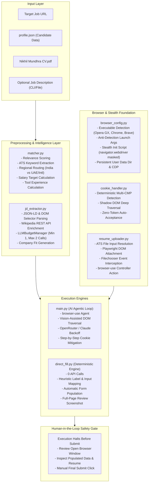
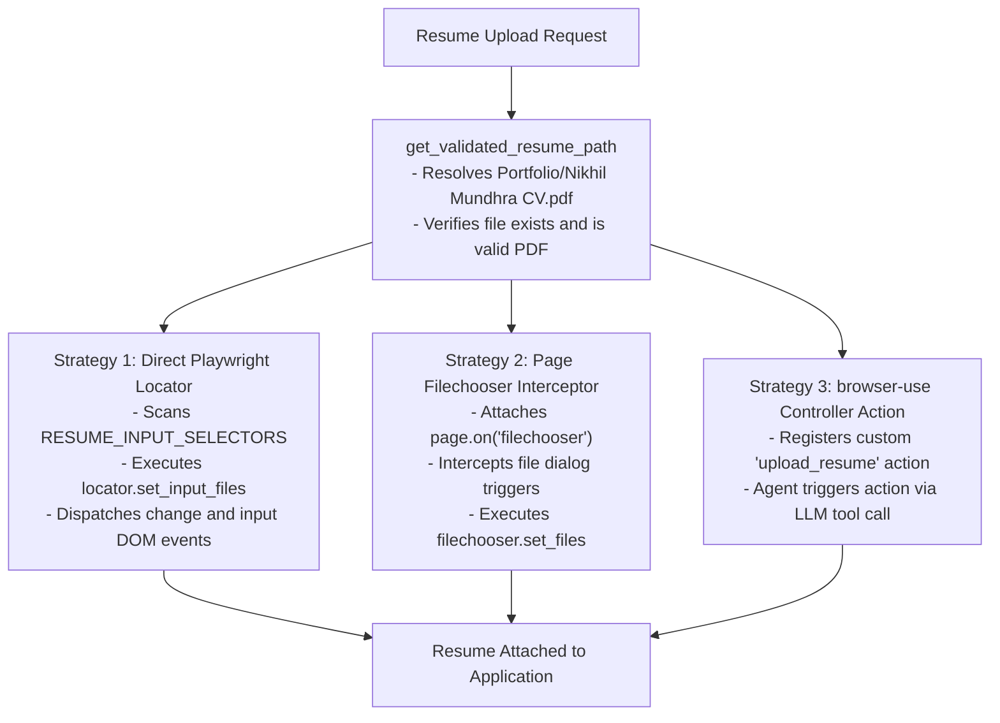

# System Architecture

## Overview

The Auto Job Applier is a local-first, privacy-preserving application automation system designed to run on a single machine without external cloud browser infrastructure. The system is architected around three foundational principles:

1. **Zero or Strictly Bounded LLM Overhead**: Deterministic operations are prioritized across all stages (DOM parsing, ATS field matching, cookie handling, resume upload, and company intelligence fetching). LLM calls are strictly bounded to at most two invocations during job preparation, and zero invocations when using the direct deterministic filling engine.
2. **Dual Execution Pathways**:
   - **AI Agentic Mode (`main.py`)**: A vision-driven agent loop powered by `browser-use` and multi-modal LLMs (OpenRouter GPT-4o / Claude Sonnet) for non-standard, highly dynamic, or multi-step portals.
   - **Direct Deterministic Mode (`direct_fill.py`)**: A high-speed, zero-API-cost Playwright engine utilizing semantic heuristics, label matching, and DOM traversal for standard ATS platforms (Workday, Greenhouse, Lever, Ashby, JazzHR, etc.).
3. **Human-in-the-Loop Safety Gate**: The system strictly halts prior to final application submission. It populates all candidate data, addresses, custom screening responses, and resumes, and then preserves the browser context for manual human review and confirmation.

---

## High-Level Architecture Diagram



---

## Dual Execution Engine Pathways

The architecture provides two complementary execution pathways depending on cost tolerance, portal complexity, and speed requirements.

```mermaid
sequenceDiagram
    autonumber
    actor User
    participant CLI as CLI Entrypoint
    participant Intel as Intelligence Layer (matcher / jd_extractor)
    participant Engine as Selected Engine (main.py / direct_fill.py)
    participant Browser as Chromium Browser (Stealth Mode)
    participant ATS as Job Portal / ATS

    User->>CLI: Invokes with Job URL
    CLI->>Intel: Curates Profile & Extracts Context
    alt AI Agentic Mode (main.py)
        CLI->>Engine: Initiates browser-use Agent
        Engine->>Browser: Launches with anti-detection flags
        Browser->>ATS: Navigates to application URL
        loop Each Step
            Engine->>Browser: Evaluates cookie_handler JS
            Engine->>Browser: Captures vision screenshot & DOM
            Engine->>Engine: LLM decides next actions (fill, click, scroll)
            Engine->>Browser: Executes actions (including resume upload)
        end
    else Direct Deterministic Mode (direct_fill.py)
        CLI->>Engine: Launches Playwright directly (0 API calls)
        Engine->>Browser: Launches persistent or ephemeral context
        Browser->>ATS: Navigates to application URL
        Engine->>Browser: Injects stealth evasions & accepts cookies
        Engine->>Browser: Sets resume file via locator set_input_files
        Engine->>Browser: Scans form fields via heuristics & fills data
        Engine->>Browser: Captures full-page review screenshot
    end
    Engine->>User: Halts before submit; prompts for manual review
    User->>ATS: Reviews form and clicks Submit manually
```

---

## Subsystem Specifications

### 1. Candidate Profile Layer (`profile.json`)

`profile.json` serves as the single source of truth for candidate data. It contains structured records designed for programmatic parsing and filtering:

- **Personal Demographics**: Name, gender, ethnicity, nationality, date of birth (in formatted, ISO, day, month, and year fields).
- **Multi-Region Contact Records**:
  - `uae`: Default international address (New York University Abu Dhabi, Saadiyat Island, Abu Dhabi, UAE) paired with the primary phone number (`+971 503526342`).
  - `india`: Domestic address (New Delhi, India) paired with the secondary phone number (`+91 7060410033`).
- **Education Records**: Institutions, degrees, majors, cumulative GPAs, and date ranges.
- **Work History and Projects**: Structured objects containing position titles, organizations, dates, technology stacks, metrics, and granular duty bullet points.
- **Categorized Skills**: Multi-disciplinary taxonomy encompassing Programming Languages, Frameworks & Libraries, Developer Tools & Cloud, AI / ML & Specialized Domains, and Hardware & Protocols.
- **Screening & Preference Rules**: Explicit directives for visa sponsorship requirements, work authorizations, relocation willingness, salary expectations, role types (full-time, co-op, graduate programs post-May 2027), and preferred browser binaries.

---

### 2. Semantic Relevance & Profile Curation Engine (`matcher.py`)

To prevent prompt token bloating and ensure optimal ATS alignment, `matcher.py` dynamically tailors the candidate profile prior to form filling.

- **Dynamic Regional Routing (`detect_application_region`)**:
  - Analyzes the job posting URL and description for geographic markers (e.g., `.in` domains, mentions of Bangalore, Gurgaon, Mumbai, Delhi, India).
  - Automatically selects the Indian address and domestic phone number for India-based listings, and the UAE / NYU Abu Dhabi address and international phone for UAE, US, and global postings.
- **Salary Target Calculation (`calculate_desired_salary`, `extract_salary_range`)**:
  - Scans job descriptions for salary figures, compensation bands, currencies (USD, AED, INR, EUR, GBP), and pay periods (hourly, monthly, annual).
  - Formulates a target near the upper quartile (75th to 90th percentile) of the advertised band, matching the user's compensation preference.
- **Tool and Technology Tenure Quantifier (`get_tool_experience`)**:
  - Parses the candidate's work history and projects to calculate realistic, grounded experience lengths (in years or months) for requested technologies (e.g., Python, PyTorch, Docker) rather than relying on arbitrary estimates.
- **Keyword Extraction and Duty Reordering (`score_experience`, `score_project`, `curate_profile`)**:
  - Normalizes text tokens and matches against a comprehensive taxonomy of industry technologies, protocols, and methodologies.
  - Scores work experiences and projects based on keyword overlap and semantic relevance.
  - Reorders bullet points within each role so that matching duties are presented first.
  - Emits a lean profile payload containing only the top 2-3 most relevant roles and projects.

---

### 3. Job Description & Company Intelligence Extractor (`jd_extractor.py`)

Extracts job context and company intelligence while enforcing a deterministic-first architecture and bounded LLM utilization.

- **Deterministic Extraction**:
  - First attempts to parse Schema.org JSON-LD `<script type="application/ld+json">` metadata for structured `JobPosting` objects.
  - Falls back to common ATS DOM selectors (Workday, Greenhouse, Lever, Taleo, Ashby, SmartRecruiters) to locate job title and description text.
- **Wikipedia REST API Company Enrichment**:
  - Fetches objective company background information via the public Wikipedia REST API without using LLM tokens.
- **Strict LLM Call Budget (`LLMBudgetManager`)**:
  - Enforces a strict budget: minimum 1 call, maximum 2 calls.
  - Standard Path: 0 LLM calls for JD extraction (deterministic parser succeeds) + 1 LLM call to synthesize company fit answers = 1 total call.
  - Fallback Path: 1 LLM call for JD extraction (if deterministic parsing yields insufficient content) + 1 LLM call for company fit answers = 2 total calls.
  - Raises `LLMBudgetExceededError` or `LLMBudgetUnderflowError` if call constraints are violated.

---

### 4. Browser Configuration & Anti-Detection Subsystem (`browser_config.py`)

Ensures high reliability and avoids bot detection barriers by using retail installed browsers and anti-automation configurations.

- **Browser Discovery Hierarchy (`find_chromium_executable`)**:
  1. `BROWSER_EXECUTABLE_PATH` environment variable override (if configured).
  2. Installed retail consumer browsers in `/Applications`:
     - Opera GX (`/Applications/Opera GX.app/Contents/MacOS/Opera`)
     - Google Chrome (`/Applications/Google Chrome.app/Contents/MacOS/Google Chrome`)
     - Brave Browser (`/Applications/Brave Browser.app/Contents/MacOS/Brave Browser`)
     - Microsoft Edge, Chromium, Vivaldi.
  3. Playwright local cache (`~/Library/Caches/ms-playwright`) as a final fallback.
- **Anti-Detection Command-Line Flags (`get_browser_launch_args`)**:
  - `--disable-blink-features=AutomationControlled` to remove automated controller flags.
  - `--use-mock-keychain` and `--password-store=basic` to prevent macOS system keychain access prompts.
  - `--disable-features=Translate` to prevent intrusive translation modals.
  - `--no-default-browser-check` and `--no-first-run` to eliminate first-run configuration prompts.
- **Stealth Script Injection (`STEALTH_INIT_SCRIPT`)**:
  - Redefines `navigator.webdriver` to return `undefined`.
  - Stubs `window.chrome` with `{ runtime: {} }` when running in non-Chrome Chromium environments.
- **State Persistence & CDP Integration**:
  - Supports persistent session storage via `BROWSER_USER_DATA_DIR` to maintain logins and cookies across multiple runs.
  - Supports connecting to an already running browser instance via Chrome DevTools Protocol (`CDP_URL`).

---

### 5. Deterministic Cookie Auto-Acceptance (`cookie_handler.py`)

Cookie banners frequently obstruct form inputs and break automation scripts. `cookie_handler.py` solves this deterministically with zero token overhead.

- **Deep Tree Walker**: Traverses the document and recursively penetrates all open Shadow DOM roots (`NodeFilter.SHOW_ELEMENT`).
- **Known CMP Selectors**: Explicit targeting of primary consent buttons for OneTrust, Cookiebot, Osano, Didomi, TrustArc, Usercentrics, Workday consent banners, Quantcast, Klaro, and Civic UK.
- **Fuzzy Regex Fallback**: If known selectors are absent, evaluates visible, clickable button and link elements against a regex matching positive consent phrases (`Accept All`, `Allow All`, `I Agree`, `Enable All`) while strictly excluding negative or preference terms (`Reject`, `Decline`, `Manage`, `Preferences`).
- **Synthetic Event Dispatch**: Triggers `pointerdown`, `mousedown`, `pointerup`, `mouseup`, and `click` events to ensure event handlers registered by various frameworks are properly fired.

---

### 6. Multi-Modal Resume Upload Pipeline (`resume_uploader.py`)

Attaches the candidate's resume (`Portfolio/Nikhil Mundhra CV.pdf`) across diverse ATS architectures through three redundant mechanisms:



- **Target ATS Selectors**: Pre-configured selector definitions covering Workday (`data-automation-id="file-upload"`), Greenhouse (`#resume_file`), Lever (`#resume-upload-input`), Ashby (`input[id*="resume"]`), and generic input patterns.
- **Direct Locator Injection**: Uses Playwright's `set_input_files` directly on hidden or visible file inputs, followed by synthetic `change` and `input` events.
- **FileChooser Interceptor**: Listens for Playwright `filechooser` events so that clicks on custom styled "Upload Resume" buttons or drag-and-drop zones are automatically handled.
- **Controller Action**: Exposes an `upload_resume` action to `browser-use` agents, allowing the visual agent to trigger upload deterministically when encountering custom file widgets.

---

### 7. Form Population Engine (`direct_fill.py`)

`direct_fill.py` is an independent, 0-API-call Playwright execution script designed for standard ATS forms.

- **Semantic Field Analysis**:
  - Inspects `<label>` text, `placeholder`, `aria-label`, `name`, and `id` attributes.
  - Matches personal information (First Name, Last Name, Email, Phone, LinkedIn, GitHub, Website).
  - Matches address components based on the dynamically selected region (Street, Line 2, City, State/Province, Postal Code, Country).
  - Handles education fields (University, Degree, Discipline, GPA, Graduation Year).
  - Handles experience fields (Company, Title, Start Date, End Date).
- **Custom Screening Questions**:
  - Maps common screening questions (sponsorship, legal authorization, relocation, salary requirements, notice period, earliest start date) to curated answers.
- **Component Handlers**:
  - Standard text inputs and textareas.
  - Dropdowns (`<select>` elements and custom div/listbox options).
  - Radio buttons and single-choice inputs.
  - Legal and authorization checkboxes.
- **Verification Artifact**:
  - Automatically captures a full-page review screenshot saved to `application_review.png` (or custom path specified by `--screenshot`).

---

### 8. AI Agentic Loop (`main.py`)

For unconventional, multi-page, or heavily dynamic application portals, `main.py` provides an autonomous visual agent loop.

- **Framework**: Built on `browser-use` with Playwright and LangChain chat model adapters.
- **Multi-Provider LLM Hierarchy**:
  - Default: OpenRouter (`openai/gpt-4o`) with automatic fallback to Anthropic (`claude-3-5-sonnet-20241022`).
  - Fallback: Direct Anthropic if only `ANTHROPIC_API_KEY` is provided.
- **Rate-Limit Resilience**: Custom retry wrapper in `JobApplierAgent.get_model_output` with exponential backoff to handle OpenRouter HTTP 402 or in-flight budget limit errors.
- **Visual Context**: Operates with computer vision enabled (`use_vision=True`) to interpret spatial relationships and complex UI controls.
- **Per-Step Cookie Clearance**: Injects `auto_accept_cookies` at every agent step to dismiss deferred or route-change cookie prompts.

---

## Safety & Operational Policies

### Human-in-the-Loop Safety Gate

Under no circumstances will either execution engine click the final application submission button (e.g., "Submit Application", "Submit", "Apply Now" on the final review stage).

1. The agent or script completes all identifiable form fields and attaches the resume.
2. The browser instance remains open on screen.
3. Execution pauses and prompts the user in the terminal.
4. The candidate reviews the completed fields, answers any unique portal-specific questions, and clicks Submit manually.

### Data Privacy & Local-First Isolation

- All candidate profile data remains on the local disk in `profile.json`.
- Resumes remain in local storage (`Portfolio/Nikhil Mundhra CV.pdf`).
- No cloud browser environments or third-party web scraping proxies are utilized.
- LLM interactions (when running `main.py` or JD preparation) only transmit job text and relevant profile excerpts necessary to generate answers.

---

## Testing & Quality Assurance

The codebase includes an automated test suite executed via `pytest`:

```bash
.venv/bin/pytest
```

The test suite covers:
- `test_browser_config.py`: Executable discovery, CLI flags, and stealth scripts.
- `test_cookie_handler.py`: CMP selector patterns, Shadow DOM traversal logic, and execution safety.
- `test_extractor_and_budget.py`: Deterministic parsing, Wikipedia enrichment, and `LLMBudgetManager` bounds enforcement.
- `test_matcher.py`: Region detection, salary band calculations, keyword scoring, duty reordering, and tool experience calculations.
- `test_resume_uploader.py`: Path resolution, ATS selector definitions, file chooser interception, and controller actions.
